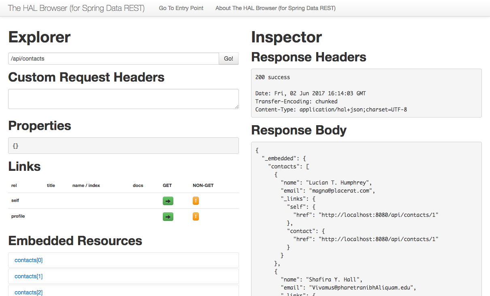

:basedir: ../../../spring-data-rest

# Spring Data REST

This recipe shows how Spring Data repositories can be exposed as a REST API without boilerplate code.

This recipe uses https://projects.spring.io/spring-boot/[Spring Boot] {spring-boot-version} and the https://github.com/mikekelly/hal-browser[HAL Browser].

## Code

The starting point is the `pom.xml`

[source,xml,numbered]
.pom.xml (key dependencies)
----
include::{basedir}/pom.xml[tags=compile;runtime]
----
<1> http://projects.spring.io/spring-data-rest/[Spring Data REST].
Spring Data REST builds on top of Spring Data repositories, analyzes your application’s domain model and exposes hypermedia-driven HTTP resources for aggregates contained in the model.
<2> https://github.com/mikekelly/hal-browser[The HAL browser].
An API browser for the hal+json media type
<3> http://projects.spring.io/spring-data-jpa/[Spring Data JPA]
Part of the larger http://projects.spring.io/spring-data/[Spring Data] family, makes it easy to easily implement https://en.wikipedia.org/wiki/Java_Persistence_API[JPA] based repositories.
This module deals with enhanced support for JPA based data access layers. It makes it easier to build Spring-powered applications that use data access technologies.
<4> http://www.h2database.com/[H2],  a relational database management system written in Java. It can be embedded in Java applications or run in the client-server mode.

Next we have the *JPA Entity*:

[source,java,numbered]
.Contact.java
----
include::{basedir}/src/main/java/es/unizar/iaaa/contacts/Contact.java[]
----

Next we have a *CRUD Repository* :

[source,java]
.ContactRepository.java
----
include::{basedir}/src/main/java/es/unizar/iaaa/contacts/ContactRepository.java[]
----

And a `import.sql` created with the tool http://benkeen.github.io/generatedata/[Generate data]

[source,sql,numbered]
.import.sql (excerpt)
----
include::{basedir}/src/main/resources/import.sql[lines=4..8]
----

Finally, the main application.

[source,java,numbered]
.Application.java
----
package es.unizar.iaaa.contacts;

import org.springframework.boot.SpringApplication;
import org.springframework.boot.autoconfigure.SpringBootApplication;

@SpringBootApplication                                            # <1>
public class Application {

        public static void main(String[] args) {
                SpringApplication.run(Application.class, args);   # <2>
        }
}
----

<1> Indicates this is the configuration class of a Spring Boot application.
<2> This start the Spring Boot framework.

and the file declaration of the base path of the REST services:

[source,properties,numbered]
.application.properties
----
include::{basedir}/src/main/resources/application.properties[]
----

## Running the code

Run the code using the *maven* wrapper

[source,console]
----
./mvnw spring-boot:run
----

or the *gradle* wrapper:

[source,console]
----
./mvnw --projects spring-data-rest spring-boot:run
----

We can then access the HAL Browser on http://localhost:8080/api/browser/index.html#/api/contacts.
The response body returns all the contacts and provides http://stateless.co/hal_specification.html[HAL metadata].
The profile link (http://localhost:8080/api/browser/index.html#/api/profile/contacts) returns an http://alps.io/[ALPS profile] document.
The profile explains that you can also do GET, POST, PUT, PATCH and DELETE at http://localhost:8080/api/contacts.

.Spring Data REST – HAL Browser
